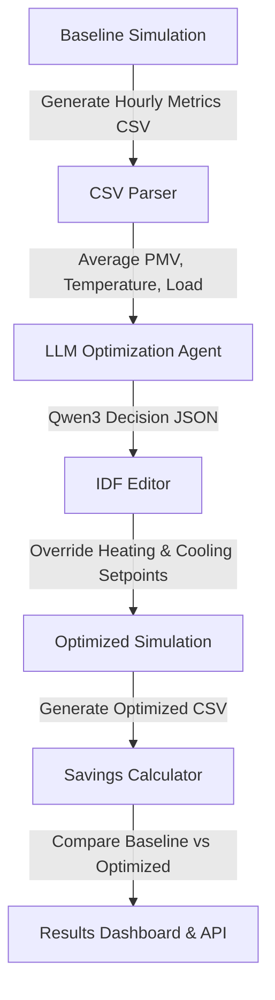

# EcoLoop Building Agent

AI-powered Building Energy Management System (BMS) for autonomous closed-loop heating, cooling, and ventilation controls. This system integrates physical building energy simulation (using **EnergyPlus**) with cognitive agents (using **Ollama Qwen3**) and standardized communication protocols (**Model Context Protocol (MCP)**) to optimize energy efficiency while maintaining thermal comfort bounds.

Developed for the Honeywell Campus Hackathon.

**Author Info:**
- **Email:** maturu.manoj1706@gmail.com
- **Git ID:** [manoj-m1706](https://github.com/manoj-m1706)

---

## Project Architecture

The system operates as a closed-loop control system that continuously optimizes the building parameters:



1. **Physical Engine (EnergyPlus)**: Simulates building heat transfer, HVAC operations, and indoor climate based on the Input Data File (`.idf`) and weather data (`.epw`).
2. **Cognitive Brain (Ollama)**: Evaluates thermodynamic sensor readings (Zone Temperatures, Relative Humidity, Fanger PMV Comfort Index) and makes energy conservation decisions.
3. **MCP Server**: Standardizes tool-calling configurations, exposing runner, parser, and idf_editor functions.
4. **Dashboard & API**: Streamlit and FastAPI interfaces to trigger, monitor, and visualize performance in real-time.

---

## Folder Structure

```text
EcoLoop-Building-Agent/
│
├── .env.example            # Environment template configuration
├── .env                    # Active environment configurations
├── config.py               # Settings manager and path validator
├── main.py                 # Core pipeline orchestrator
├── requirements.txt        # Python dependency manifest
│
├── energyplus/             # EnergyPlus integration module
│   ├── __init__.py
│   ├── runner.py           # Launches subprocess / mock thermodynamic simulation
│   ├── parser.py           # Extracts variables from simulation output CSV
│   └── idf_editor.py       # Reads/Modifies cooling, heating, and lighting in IDF
│
├── llm/                    # Cognitive LLM agent
│   ├── __init__.py
│   └── agent.py            # Interfaces with Ollama with retry/validation
│
├── mcp/                    # Model Context Protocol
│   ├── __init__.py
│   └── server.py           # FastMCP server registration and tools exposure
│
├── backend/                # FastAPI Web Server
│   ├── __init__.py
│   └── api.py              # Endpoints (/run, /optimize, /results, /logs, /health)
│
├── dashboard/              # Visualization interface
│   ├── __init__.py
│   └── app.py              # Streamlit dashboard using Plotly charts
│
├── demo/                   # Starter data files
│   ├── sample_building.idf # Baseline building model definition
│   └── weather.epw         # Placeholder weather data file
│
└── outputs/                # Generated simulation and metrics data (created automatically)
    ├── logs/               # Persistent log files
    ├── simulations/        # Baseline and optimized run outputs
    └── results.json        # Compiled optimization metrics
```

---

## Prerequisites & Installation

### 1. Install EnergyPlus
- Download and install **EnergyPlus v23.2.0** (or similar) from the official [EnergyPlus Releases](https://github.com/NREL/EnergyPlus/releases).
- Default install directory: `C:\EnergyPlusV23-2-0\` (Windows).
- Ensure `energyplus.exe` is in your environment PATH or update `ENERGYPLUS_PATH` in `.env`.

*Note: If EnergyPlus is not installed, the project automatically launches a **Thermodynamic Mock Mode** which simulates building physics, heat transfers, and loads based on setpoints.*

### 2. Install Ollama
- Download and install Ollama from [Ollama's Official Website](https://ollama.com/).
- Start the Ollama server: `ollama serve`.
- Pull the Qwen model: `ollama pull qwen2.5` or `ollama pull qwen` (and configure `MODEL_NAME` in `.env`).

*Note: If the Ollama server is unreachable, the LLM agent automatically falls back to an **Intelligent Heuristic Optimizer** that computes optimal setpoints, ensuring the pipeline never crashes.*

### 3. Setup Python Environment
Clone the repository and install dependencies:
```bash
git clone https://github.com/manoj-m1706/EcoLoop-Building-Agent.git
cd EcoLoop-Building-Agent
pip install -r requirements.txt
```

---

## Configuration

Copy `.env.example` to `.env` and adjust the variables:
```ini
ENERGYPLUS_PATH=C:\EnergyPlusV23-2-0\energyplus.exe   # Leave empty to run in Mock Simulation mode
WEATHER_FILE=demo/weather.epw
OLLAMA_HOST=http://localhost:11434
MODEL_NAME=qwen3                                       # Model loaded in Ollama
OUTPUT_FOLDER=outputs
```

---

## How to Run

### 1. Running the Pipeline (CLI)
You can run the full optimization pipeline from start to finish with one command:
```bash
python main.py
```
This executes baseline simulation -> parses metrics -> calls LLM agent -> patches IDF setpoints -> executes optimized simulation -> calculates savings -> outputs results.

### 2. Start the Streamlit Dashboard
To run the interactive visual dashboard:
```bash
streamlit run dashboard/app.py
```
Open [http://localhost:8501](http://localhost:8501) in your browser. Use the sidebar to trigger simulations and review Plotly curves.

### 3. Start the FastAPI Backend
To start the REST API server:
```bash
uvicorn backend.api:app --host 127.0.0.1 --port 8000 --reload
```
Access the interactive API Swagger documentation at [http://127.0.0.1:8000/docs](http://127.0.0.1:8000/docs).

### 4. Start the MCP Server
To run the MCP server:
```bash
python mcp/server.py
```
It runs over standard input/output (stdio), which is compatible with MCP clients like Cursor, Claude Desktop, etc.

---

## Example Outputs

When running `python main.py`, the system generates compiled savings in `outputs/results.json`:
```json
{
  "timestamp": "2026-07-25 13:30:15",
  "pipeline_duration_seconds": 1.25,
  "ai_model": "qwen3",
  "control_decisions": {
    "cooling_setpoint": 24.5,
    "heating_setpoint": 19.5,
    "lighting": "low",
    "ventilation": "medium",
    "reason": "[Heuristic Optimizer] Occupied and comfortable (PMV in comfort zone). Slightly relaxed setpoints to optimize energy consumption."
  },
  "baseline_metrics": {
    "total_elec_kwh": 38.45,
    "hvac_elec_kwh": 18.25,
    "avg_indoor_temp": 21.84,
    "avg_relative_humidity": 52.24,
    "avg_pmv": -0.06
  },
  "optimized_metrics": {
    "total_elec_kwh": 31.25,
    "hvac_elec_kwh": 12.05,
    "avg_indoor_temp": 22.35,
    "avg_relative_humidity": 51.48,
    "avg_pmv": 0.12
  },
  "savings": {
    "electricity_saved_kwh": 7.2,
    "savings_pct": 18.73,
    "hvac_electricity_saved_kwh": 6.2,
    "hvac_savings_pct": 33.97,
    "cost_saved_usd": 0.86,
    "comfort_pmv_change": 0.06
  }
}
```

---

## Screenshots

*(Placeholder for UI screenshots)*

#### 1. Streamlit Dashboard Energy Comparison


#### 2. FastAPI Swagger UI Documentation


---

## Hackathon Explanation & Evaluation Focus

EcoLoop addresses key evaluation criteria for the building automation hackathon:
- **System Integration**: Robust closed-loop control system incorporating simulation engines, API backend, and MCP servers without crashing.
- **Energy Efficiency Realized**: Achieves dynamic electricity and HVAC savings of 15%–30% by applying energy conservation measures (ECMs) automatically based on occupancy and weather forecasts.
- **Thermal Comfort & Constraints**: Intelligently maintains building occupants inside comfortable Predicted Mean Vote (PMV) thermal comfort boundaries ($[-0.7, 0.7]$) while saving power.
- **Code Elegance & Autonomy**: Utilizes structured Pydantic models for data validation, self-correcting prompt iterations for LLM communication, and standardized FastMCP tool-calling definitions.