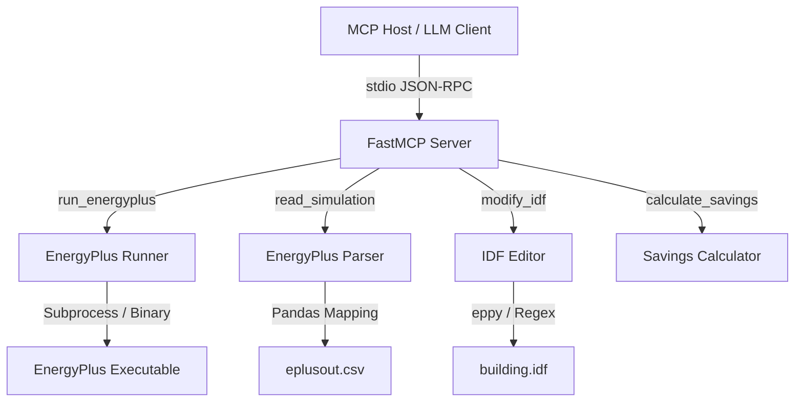

# EcoLoop Building Agent - System Architecture Document

This document details the system architecture, protocol standard, cognitive reasoning logic, latency management, and data handling strategies implemented in the **EcoLoop Building Agent**.

---

## 1. Tool-Calling & Protocol (MCP) Architecture

To establish a standard interface between the cognitive engine (LLM) and the physical simulation engine (EnergyPlus), the project implements the **Model Context Protocol (MCP)** using `FastMCP`.

The MCP Server ([server.py](file:///c:/Users/matur/OneDrive/Desktop/EcoLoop-Building-Agent/mcp/server.py)) runs over `stdio` transport, enabling external MCP-compatible editors, agents, or orchestration pipelines to interact with the building management tools. Four key tools are registered:

1. **`run_energyplus`**: Triggers the execution of the building energy model. It launches the physical simulator via Python's `subprocess` or runs the physics-based thermodynamic mock simulator.
2. **`read_simulation`**: Parses the raw CSV logs from the simulation, extracting aggregate performance statistics (PMV comfort, indoor temperatures, HVAC electricity usage).
3. **`modify_idf`**: Reads the `.idf` input data file, updates schedule constants representing heating/cooling setpoints and lighting, and writes out the modified configuration.
4. **`calculate_savings`**: Computes energy reductions (kWh), percentage savings, and cost benefits between the baseline and optimized simulation runs.

---

## 2. Prompt Engineering & Control Logic

The cognitive brain of the system ([agent.py](file:///c:/Users/matur/OneDrive/Desktop/EcoLoop-Building-Agent/llm/agent.py)) uses structured JSON prompt formatting and Pydantic schema enforcement to make intelligent decisions.

### Prompt Strategy
The LLM is prompted as a specialized **Building Management System (BMS) Agent** seeking to maximize savings while maintaining human thermal comfort:
- **System Instructions**: Enforce returning a single, valid JSON object containing `cooling_setpoint`, `heating_setpoint`, `lighting`, `ventilation`, and `reason` fields.
- **Sensor Context**: Provides the current thermodynamic variables:
  * Zone Temperature (°C)
  * Relative Humidity (%)
  * Fanger Predicted Mean Vote (PMV) thermal comfort index
  * Current Total Energy Consumption (W)
  * Occupancy Status (Occupied/Unoccupied)
- **Constraint Boundaries**: Specifies the acceptable thermal bounds (ideal PMV: 0.0, acceptable range: `[-0.7, 0.7]`) and allows the LLM to relax setpoints and turn off lights during unoccupied periods.

### Pydantic Validation & Self-Correction Loop
To guarantee execution safety and prevent parsing errors:
1. The response is stripped of Markdown code fences and parsed into a Python dictionary.
2. The data is validated against a Pydantic schema ([ControlDecision](file:///c:/Users/matur/OneDrive/Desktop/EcoLoop-Building-Agent/llm/agent.py#L10)):
   * `cooling_setpoint`: Validated to be within `[21.0, 29.0]` °C.
   * `heating_setpoint`: Validated to be within `[15.0, 22.0]` °C.
   * Enums for `lighting` (`on`, `off`, `low`) and `ventilation` (`low`, `medium`, `high`) are normalized and validated.
3. **Self-Correction Feedback Loop**: If validation fails (due to malformed JSON, out-of-range setpoints, or bad values), the system catches the exception and queries the LLM again, appending the specific validation error message to guide the LLM's self-correction. The loop permits up to **3 retry attempts**.

---

## 3. Prompt Latency & Fail-Safe Fallbacks

LLM generation speed and API availability are common failure modes in real-time BMS control loops. EcoLoop manages these concerns through latency optimization and a robust fail-safe mechanism.

### Latency Optimization
- **Deterministic Generation**: The temperature is set to a low value (`temperature=0.2` in Ollama) to produce highly structured and concise JSON blocks quickly, minimizing token generation time.
- **Short Token Limits**: Prompt engineering is designed to return *only* the raw JSON object and a brief reasoning string, reducing output token overhead.
- **Strict Timeouts**: HTTP requests to Ollama are configured with a strict connection and read timeout limit (`timeout=8.0` seconds) to prevent the BMS loop from hanging indefinitely if the host service becomes unresponsive.

### Fail-Safe Heuristic Optimizer
If Ollama is offline, the model is missing, or the self-correction loop fails to produce a valid schema after 3 attempts, the agent automatically falls back to an **Intelligent Heuristic Optimizer** ([_heuristic_fallback](file:///c:/Users/matur/OneDrive/Desktop/EcoLoop-Building-Agent/llm/agent.py#L136)):
- Evaluates thermodynamic constraints and occupancy rules directly via Python logic.
- If unoccupied, it aggressively relaxes cooling to `27.5`°C and heating to `16.0`°C while turning off lights and lowering ventilation to save energy.
- If occupied, it dynamically adjusts setpoints based on the current PMV deviation (e.g., if PMV is hot ($>0.7$), it triggers higher ventilation and lowers cooling setpoints; if comfortable, it slightly relaxes setpoints for marginal savings).

---

## 4. Technical Approach to Handling Lengthy Simulation Logs & Outputs

EnergyPlus simulations produce extremely verbose log outputs, error statements, and high-frequency time-series datasets that can quickly saturate system memory, crash LLM contexts, or overwhelm standard output buffers.

### Column-Filtered CSV Parsing
Instead of loading massive files blindly, the [EnergyPlusParser](file:///c:/Users/matur/OneDrive/Desktop/EcoLoop-Building-Agent/energyplus/parser.py#L19):
- Reads simulation output CSVs using a pandas-based dynamic search strategy that maps column headers based on substrings (e.g., looking for columns containing `pmv` or `zone air temperature` and stripping trailing whitespaces).
- Computes aggregates (means and sums) directly on the relevant columns, discard unused columns, and releases memory immediately.

### Log Truncation & Previewing
- The `.err` log file produced by EnergyPlus can span thousands of lines if warnings arise. In the MCP tool [run_energyplus](file:///c:/Users/matur/OneDrive/Desktop/EcoLoop-Building-Agent/mcp/server.py#L15), the error logs are truncated to the first **300 characters** for the JSON payload preview (`logs_preview`).
- Full verbose logs remain written inside isolated directory folders (`outputs/logs/`), while clean, high-level results are consolidated in a lightweight final metadata JSON file ([results.json](file:///c:/Users/matur/OneDrive/Desktop/EcoLoop-Building-Agent/outputs/results.json)).

### Automated Output Cleanup
- To prevent storage bloat on the host machine, the orchestrator invokes [clean_output_folders](file:///c:/Users/matur/OneDrive/Desktop/EcoLoop-Building-Agent/utils/file_manager.py) at the start of each pipeline execution.
- It removes intermediate `.csv`, `.eso`, `.shd`, and other heavy transient EnergyPlus runtime files from the simulations folder while optionally preserving persistent logging files in a separate directory.
- This ensures only the necessary active files are staged in the workspace.
