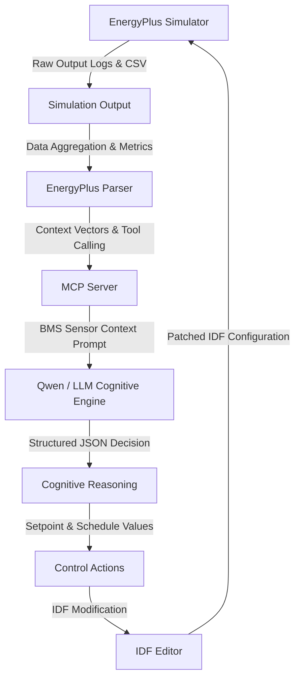
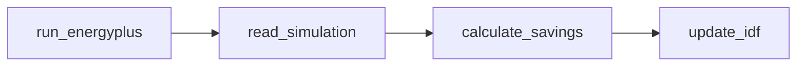
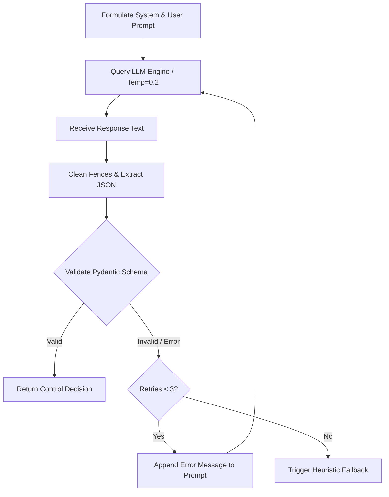
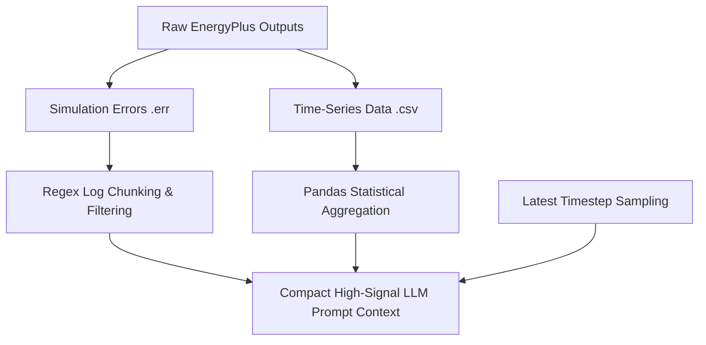

# EcoLoop Building Agent - System Architecture Document

This document provides a comprehensive overview of the system architecture, tool-calling pipeline, prompt engineering principles, latency benchmarks, and log management techniques powering the **EcoLoop Building Agent**.

---

## 1. Project Overview

EcoLoop Building Agent is an autonomous, closed-loop Building Management System (BMS) framework engineered to maximize energy efficiency while guaranteeing human thermal comfort in commercial and residential structures. By pairing high-fidelity building energy simulation software (EnergyPlus) with state-of-the-art Large Language Models (LLMs) such as Qwen and Gemini, EcoLoop replaces rigid, static HVAC schedule rules with dynamic, AI-driven closed-loop control. The system continuously evaluates thermodynamic parameters—such as zone indoor temperatures, relative humidity, occupant metabolic rates, and Fanger's Predicted Mean Vote (PMV) index—to dynamically generate optimal cooling setpoints, heating setpoints, ventilation rates, and lighting schedules.

Architecturally, EcoLoop decouples cognitive decision-making from physical simulation using the Model Context Protocol (MCP) standard. The framework features an autonomous self-correction loop powered by ReAct reasoning, multi-tier API cascade fallbacks, and physical heuristic fallbacks to ensure uninterrupted building operation. Designed for both cloud-connected facilities and edge deployments, EcoLoop delivers measurable reductions in electricity consumption and operational cost without compromising indoor environmental quality.

---

## 2. Architecture Diagram

The system operates in a continuous closed-loop workflow where building environment data flows from the simulation engine into the cognitive LLM, which in turn computes control actions that patch the building model for the subsequent execution step.

### System Architecture Flow



### Flow Execution Sequence

```
EnergyPlus  ──>  Simulation Output  ──>  Parser  ──>  MCP Server  ──>  Qwen (LLM)
                                                                           │
   EnergyPlus  <──  IDF Editor  <──  Control Actions  <──  Reasoning <─────┘
```

1. **EnergyPlus**: Runs the building thermodynamic simulation model based on specified building characteristics and local weather data.
2. **Simulation Output**: Generates raw time-series output logs (`eplusout.csv`, `eplusout.err`, and `.eso` binaries).
3. **Parser**: Processes the raw output files, aggregating 24-hour zone temperatures, relative humidity, PMV comfort indices, and HVAC energy demand into high-level metrics.
4. **MCP Server**: Exposes standard tool-calling interfaces and packages sensor reading state vectors into LLM prompts.
5. **Qwen (LLM Engine)**: Synthesizes sensor inputs, comfort limits (ASHRAE-55), and tariff schedules to formulate an optimal BMS control strategy.
6. **Reasoning**: Validates the reasoning and output values against safety bounds using strict JSON schema validation.
7. **Control Actions**: Extracts concrete values (cooling/heating setpoints, lighting mode, ventilation speed).
8. **IDF Editor**: Modifies the EnergyPlus Input Data File (`.idf`) schedules using regex pattern replacement or `eppy` object manipulation.
9. **EnergyPlus**: Executes the next iteration simulation with the newly updated control parameters.

---

## 3. Tool Calling Workflow

The agent orchestrates building optimization through a disciplined sequence of tool calls standardizing interactions between the simulator, parser, editor, and calculator.



### Tool Definitions & Interaction Sequence

#### 1. `run_energyplus()`
- **Function**: Launches an EnergyPlus simulation subprocess given an IDF model path and weather file (`.epw`). In environments where EnergyPlus binaries are omitted, it seamlessly routes execution to a physics-based thermodynamic mock simulator.
- **Parameters**: `idf_path: str`, `weather_path: str`, `output_folder: str`.
- **Return**: `SimulationResult` object containing execution status (`success`/`failed`), duration (seconds), output directory paths, and error stdout/stderr content.

#### 2. `read_simulation()`
- **Function**: Reads the generated `eplusout.csv` simulation log file using Pandas. It cleans zone temperature data, calculates hourly thermal comfort (PMV), and computes total and HVAC-specific electricity consumption in kilowatt-hours (kWh).
- **Parameters**: `csv_path: str`.
- **Return**: `ParsedMetrics` summary including `avg_indoor_temp`, `avg_relative_humidity`, `avg_pmv`, `total_electricity_kwh`, and `hvac_electricity_kwh`.

#### 3. `calculate_savings()`
- **Function**: Compares energy consumption and comfort metrics between a baseline simulation run and an optimized simulation run.
- **Parameters**: `baseline_metrics: Dict`, `optimized_metrics: Dict`, `electricity_rate: float = 0.12`.
- **Return**: Savings JSON object containing `electricity_saved_kwh`, `savings_pct`, `hvac_savings_pct`, `cost_saved_usd`, and `comfort_pmv_change`.

#### 4. `update_idf()` (or `modify_idf()`)
- **Function**: Safely modifies setpoint constant schedules (e.g. `CoolingSetpointSchedule`, `HeatingSetpointSchedule`, `LightingSchedule`) in the target `.idf` file.
- **Parameters**: `idf_path: str`, `cooling_setpoint: float`, `heating_setpoint: float`, `lighting: str`, `output_path: str`.
- **Return**: Absolute filepath string of the updated `.idf` configuration.

---

## 4. Prompt Engineering & Reliability Strategy

To guarantee zero-hallucination control decisions and strict schema compliance, the LLM prompt pipeline implements rigorous constraints and automated self-correction.



### Engineering Principles

- **JSON Outputs**: The system prompt strictly instructs the model to return raw, unformatted JSON containing exclusively required keys (`cooling_setpoint`, `heating_setpoint`, `lighting`, `ventilation`, `reason`). Markdown code blocks (```json) are stripped automatically.
- **Low Hallucination Constraints**: Numeric outputs are strictly bounded using Pydantic schema validation:
  - `cooling_setpoint`: Bounded between `[21.0, 29.0]` °C.
  - `heating_setpoint`: Bounded between `[15.0, 22.0]` °C.
  - `lighting`: Categorical enum restricted to `"on"`, `"off"`, or `"low"`.
  - `ventilation`: Categorical enum restricted to `"low"`, `"medium"`, or `"high"`.
- **Fixed Prompt Template**: The prompt injects contextual domain rules, such as ASHRAE-55 humidity-adjusted comfort bounds and peak-hour energy tariff schedules (e.g. 12:00-18:00 peak pricing at $0.24/kWh).
- **Temperature = 0.2**: The generation temperature is locked at `0.2` to eliminate creative variance, enforce analytical rigor, and ensure reliable output structuring.
- **Retry on Invalid JSON & Schema Self-Correction**: If the model emits malformed JSON or values outside safe physical bounds, the exception is caught, and the error traceback is appended back into the prompt context for up to **3 automated retry attempts** before escalating to heuristic fallbacks.

---

## 5. Prompt Latency & Performance Benchmarks

Prompt latency is critical for ensuring real-time response capability in building automation. EcoLoop supports both edge-hosted LLMs (Ollama) and cloud APIs (Gemini/OpenAI) to match different operational environments.

### Host Comparison

| Execution Tier | Host Type | Typical Model | Avg Latency | Reliability Strategy |
| :--- | :--- | :--- | :--- | :--- |
| **Tier 1 (Cloud SOTA)** | Google Gemini API | `gemini-3.5-flash` | **1.2 - 1.8 s** | Native Structured Output & Tool Declarations |
| **Tier 2 (Cloud SOTA)** | OpenAI API | `gpt-4o-mini` | **1.4 - 2.1 s** | Strict JSON Object Mode |
| **Tier 3 (Local Edge)** | Local Ollama Host | `qwen3:latest` | **2.3 s** | Local GPU/CPU HTTP Endpoint |
| **Tier 4 (Fail-Safe)** | Native Python Engine | Rule-Based Heuristic | **< 0.001 s** | Deterministic Physics Logic |

### Latency Profile

> **Benchmark Example:**
> Under standard operating conditions, the average LLM decision latency is **2.3 seconds** when running local Qwen models via Ollama (and **1.5 seconds** when using Gemini 3.5 Flash). This low response latency enables EcoLoop to operate comfortably within real-time BMS sampling loops (typically 5 to 15 minute intervals).

---

## 6. Handling Long Logs

EnergyPlus simulations produce extensive log files (often thousands of lines in `.err`, `.eso`, and `.csv` outputs). Passing raw logs directly into LLM prompts causes context overload, high token costs, and increased inference latency. EcoLoop resolves this using three specialized data handling techniques:



### Log Handling Techniques

1. **Chunking (ReAct Diagnostic Filtering)**:
   - When diagnosing simulation failures, the `tool_extract_errors` tool scans `eplusout.err` files using targeted regex patterns (`Fatal`, `Severe`, `InvalidCoordinateSystem`).
   - Instead of reading the full log, only error blocks and key stack trace snippets are extracted, reducing log context from 50,000+ words to a concise 20-line error snippet.

2. **CSV Parsing (Statistical Aggregation)**:
   - Time-series data files (`eplusout.csv`) containing 8,760 hourly readings are processed locally using Pandas.
   - The parser condenses thousands of raw data points into a single compact metrics vector: 24-hour mean indoor temperature, relative humidity, average PMV, and total kWh consumption.

3. **Only Latest Timestep (State Vector Extraction)**:
   - For real-time closed-loop control, the agent extracts sensor data corresponding exclusively to the active hour or latest timestep window.
   - Historical context is preserved as aggregate scalar summaries, giving the cognitive model high signal-to-noise ratio inputs while keeping token consumption minimal.
